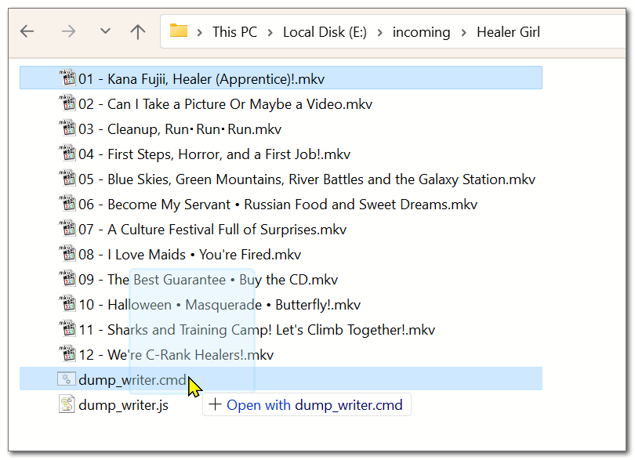
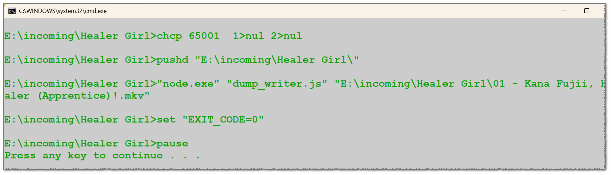
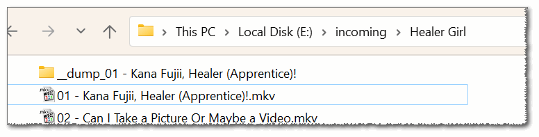
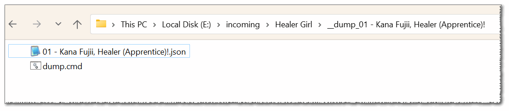
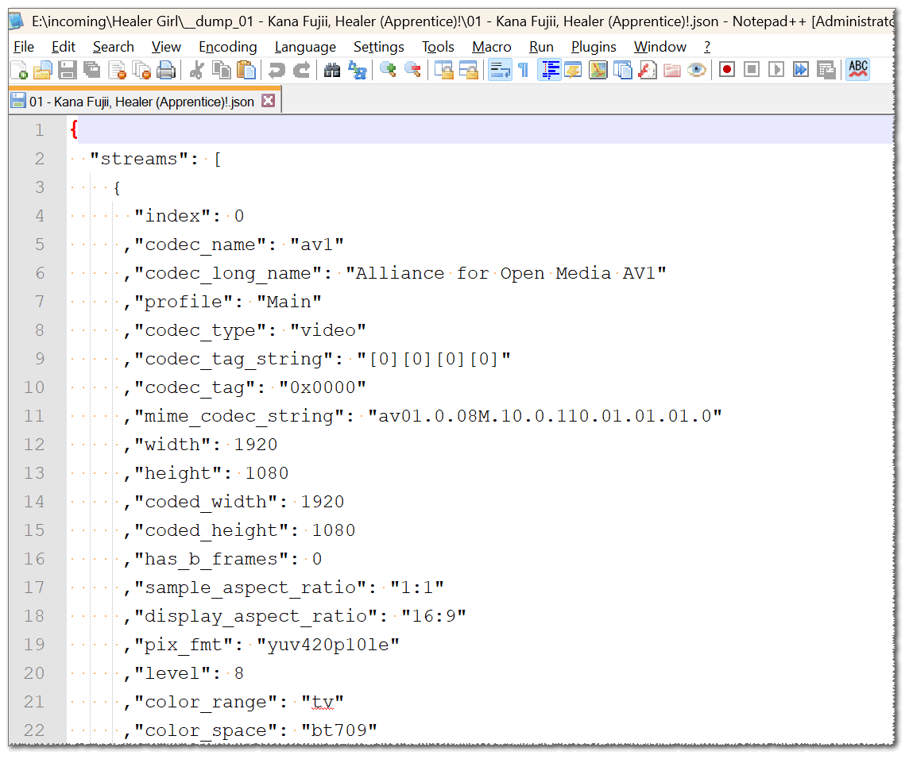
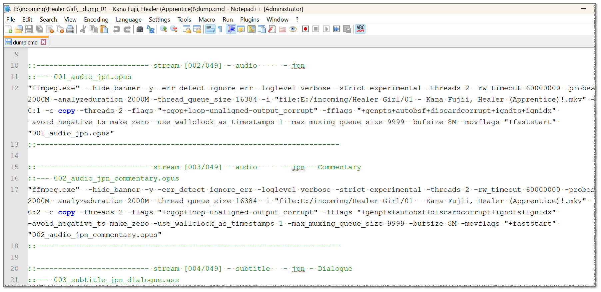
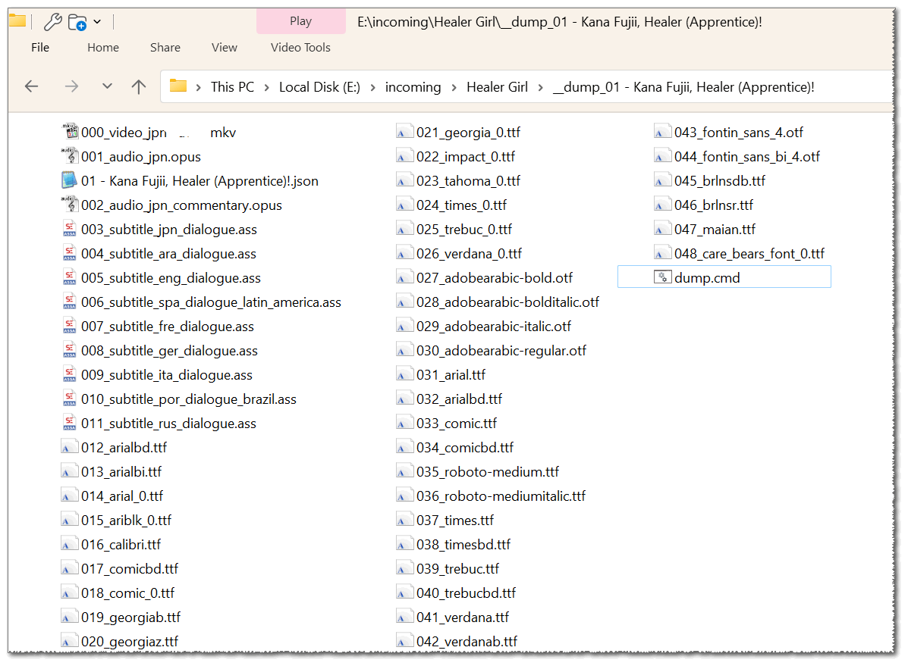
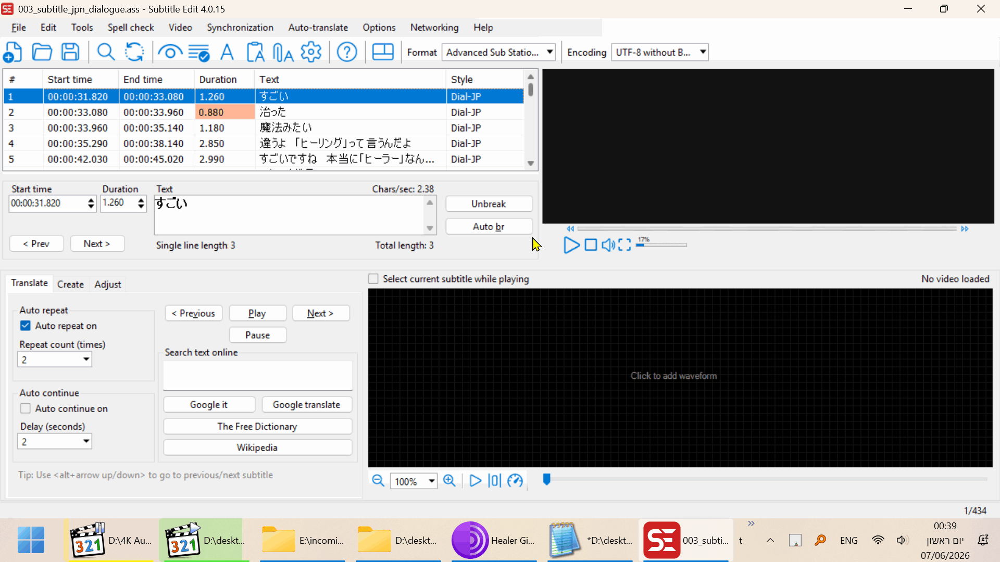
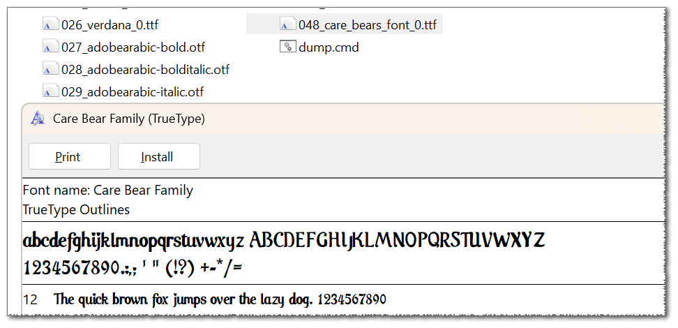
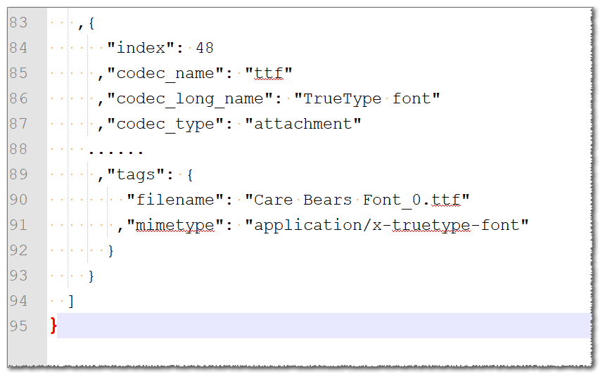

ffmpeg, ffprobe, media dump.

quickly dump every stream to its own file.  

preserving attachments such as fonts,  
and subtitles you can edit afterwards.  

this is a helpful toolkit for video encoders,  
or media analytics, recovering and fixing.  

I had a really hard time scraping the media files with various batch files and a mix of cmd and powershell,  
ffprobe provided some of the information quite easily,  
but parsing, and using was a pain in the .. !

I'll be using NodeJS to run ffprobe, parse its JSON string (no temp. files),  
and writing an explicit `.cmd` file that would preform the actual, multiple ffmpeg commands,  
I felt this should be outside of node since it could take a long while and I don't have particular need  
for NodeJS to manage it.  

you'll need:  

- NodeJS - `node.exe` - https://nodejs.org/download/nightly/v27.0.0-nightly20260602330f44f29c/win-x64/node.exe  
- `ffmpeg.exe` and `ffprobe.exe` - https://github.com/nanake/ffmpeg-tinderbox/releases/latest/download/ffmpeg-win64-nonfree.tar.zst  
- if you don't know how to unpack `.tar.zst` you can use this improved 7zip - https://github.com/mcmilk/7-Zip-zstd/releases/latest  
- `dump_writer.cmd` and `dump_writer.js` from this project, or just download the zip from - https://github.com/eladkarako/ffmpeg_media_dump/archive/refs/heads/master.zip  

make sure all the exe are either in the same folder,  
or in your system's `PATH`.  

if you already have `node.exe`, `ffmpeg.exe`, and `ffprobe.exe` of recent build, you can use those. it is fine.  

in this example I'll be working on some anime named Healer Girl ( https://myanimelist.net/anime/48857/Healer_Girl )  

  

(note: files in here are dummies, real episode names matching media-info spec, of common structure).

you just drag and drop the media file over the batch file `dump_writer.cmd`,  
you can drag and drop any amount of media files over, although I advise to no more than 10 at a time

  

you'll see a cmd window, and just press any key to end (here for debug purposes).

  

a folder, with the `__dump_` prefix will be created in the same folder as the media file.

  

inside it a JSON file, that is the (beautified) result of the `ffprobe` for the media file,  
this is mostly for debug purposes and you don't really need it.

  

it is kind-of like "media info" ( https://mediaarea.net/en/MediaInfo or the old version from https://www.codecguide.com/download_kl.htm ),  
...but a lot a lot more detailed...  
...can be useful.  

  

the file `dump.cmd` (same name, safe since it is kept in a separated folder)  
includes a command for each stream,  
including attachments, which uses a slightly different syntax,  

it includes comments to allow you to debug or edit the file afterwards.  
the comments includes the output file.

  

you might notice the absolute path to the input file. relative paths are tricky, I felt it was the best solution.

run the `dump.cmd` and you'll face a cmd window,  
that should ran very quick,  
all streams will be "muxed" out, a.k.a. stream-copy.

  

video stream will be held in `.mkv` container,  
audio and subtitles will be using the actual codec, which is the file-extension,  
in this case the encoding is mixed, you'll see `Advanced Sub Station Alpha` in `.ass` (common for anime)  

which is dumped and perfectly usable with subtitles editors such as SubtitleEdit ( https://github.com/SubtitleEdit/subtitleedit )

  

I chose to not use the exact filename of attachments, when it exist.  
to make the naming consistent 

  

as you can see the attachments are perfectly usable,  
and you can always query the JSON for the original filename (I deleted some of the information in the screenshot below to make it fit better..).  

  

as for the filenames for anything that is not an attachment,  
I have used the global stream index, stream type (audio, video),  
and language and title if available,  
making the result suitable for a filename.

the filenames index is 3 spaces padded, i.e. `1` is `001`. if your video has more then 999 streams,  
you can always edit the `.js` file to pad it with 4 digits.  

feel free to open up an issue with  
https://github.com/eladkarako/ffmpeg_media_dump/issues/new  
if you have any question.

<a href="https://paypal.me/31adkarak0" target="_blank" rel="noopener noreferrer"> </a>

 

